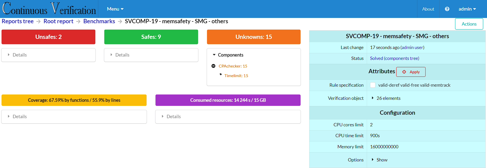

# Benchmark Visualizer

**Benchmark Visualizer** extends Witness Visualizer to support full-benchmark verification results in [SV-COMP](https://sv-comp.sosy-lab.org) format.

## Deployment

1. First, deploy the [CVV web interface](https://github.com/vmordan/cvv) according to its documentation.

2. Install Benchmark Visualizer using the following command:

```shell
make install-benchmark-visualizer DEPLOY_DIR=<deployment_directory>
```

## Usage

You will need the following information before proceeding:
- `<host>` and `<port>` of the CVV web interface server.
- `<username>` and `<password>` for web interface authentication.
- `<deployment_directory>` where Benchmark Visualizer is installed.

### 1. Create a Configuration File

Create a JSON configuration file with the following structure:

```json
{
  "uploader": {
    "upload results": true,
    "parent id": true,
    "identifier": "<parent_report_identifier>",
    "server": "<host>:<port>",
    "user": "<username>",
    "password": "<password>",
    "name": "<new_report_name>"
  },
  "Benchmark Launcher": {
    "output dir": "<absolute_path_to_verification_results>",
    "tasks dir": "<absolute_path_to_source_files>",
    "tool": "<verification_tool>"
  }
}
```

**Explanation:**
- `<parent_report_identifier>`: Report ID or name from the reports tree. If the database is new, use `1` to make the new report a child of the root.
- `<new_report_name>`: A descriptive name to identify the uploaded benchmark in the web interface.

#### Example Configuration

```json
{
  "uploader": {
    "upload results": true,
    "parent id": true,
    "identifier": "SV-COMP",
    "server": "localhost:8989",
    "user": "uploader",
    "password": "uploader",
    "name": "CPAchecker, <rundefinition> config (<timestamp>)"
  },
  "Benchmark Launcher": {
    "output dir": "/home/cvuser/results/",
    "tasks dir": "/home/cvuser/sv-benchmarks/",
    "tool": "CPAchecker"
  }
}
```

### 2. Process Benchmark Results

To process existing verification results, run:

```bash
<deployment_directory>/scripts/process_benchmark.py --config <path_to_config_file>
```

To first launch the benchmark and then process the results, use:

```bash
<deployment_directory>/scripts/process_benchmark.py --config <path_to_config_file> --launch
```

If the upload is successful, you will see a confirmation in the log such as:

```text
ZIP archive with reports "..." was successfully uploaded to "<host>:<port>/jobs/<new_report_id>"
```

You can then view the uploaded results at:
`http://<host>:<port>/jobs/<new_report_id>`

## Examples

Sample benchmark verification results are available in the `docs/examples/benchmarks` directory.

### Visualization Example


