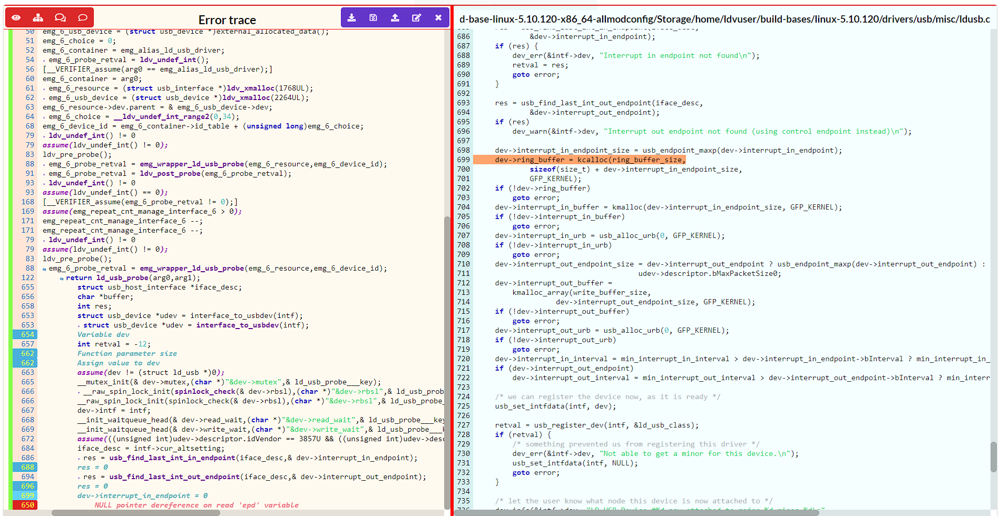

# Witness Visualizer

**Witness Visualizer** converts generic witnesses produced by [SV-COMP](https://sv-comp.sosy-lab.org) tools into a user-friendly, human-readable format.

## Requirements

Python (version ≥ 3.6) and the following Python modules:

```shell
pip3 install -r requirements.txt
```

## Deployment
To install Witness Visualizer in a desired directory, run:

```bash
make install-witness-visualizer DEPLOY_DIR=<deployment directory>
```

## Usage
After deployment, Witness Visualizer can be used to visualize witnesses with the following command:

```shell
<deployment directory>/scripts/visualize_witnesses.py OPTIONS
```
### Primary Options

- `-w`, `--witness <WITNESS>`
  Path to a single witness file to visualize.

- `-d`, `--directory <DIRECTORY>`
  Directory containing multiple witness files to visualize.
  Either `--witness` or `--directory` must be specified.

- `-r`, `--result-dir <RESULT_DIR>`
  Directory where the HTML visualizations will be saved.

- `-s`, `--source-dir <SOURCE_DIR>`
  Path to the source code directory used to match the witness with code locations.

- `--dry-run`
  Perform a validation check on the witness files without generating visualizations.

- `-u`, `--unzip`
  Automatically unzip archives containing witness files before processing.

### Example
```bash
<deployment directory>/scripts/visualize_witnesses.py \
  --witness output/witness.graphml \
  --result-dir results/ \
  --source-dir ~/sv-benchmarks
```

A set of example [SV-COMP](https://sv-comp.sosy-lab.org) witnesses is provided in the `docs/examples/witnesses` directory.
You can use these to verify that Witness Visualizer is correctly installed and functioning.

Below is a sample visualization of a violation witness:

